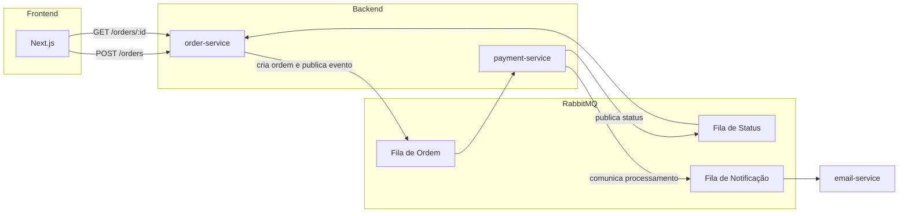

# Sistema de Pagamentos com Microsserviços

Projeto de estudo com arquitetura de microsserviços orientada a eventos, usando Spring Boot, RabbitMQ e Next.js. Simula o fluxo de criação de um pedido, processamento assíncrono de pagamento e notificação por e-mail.

## Sobre o projeto

Este projeto nasceu da prática com RabbitMQ + Spring Boot, evoluindo para um sistema completo que aplica conceitos de comunicação assíncrona entre serviços, separação de responsabilidades (database-per-service) e desacoplamento via eventos — em vez de chamadas síncronas diretas entre serviços.

## Estrutura esperada

```text
payment/
├── docker-compose.yml
├── README.md
├── order-service/
├── payment-service/
├── email-service/
└── frontend/               (Next.js)
```

## Arquitetura



### Serviços

| Serviço | Responsabilidade |
|---|---|
| **order-service** | Fonte única de verdade sobre o pedido. Recebe a criação do pedido (`POST /orders`), publica o evento `OrderCreated`, consome o evento de status vindo do `payment-service` e atualiza o pedido. Expõe `GET /orders/{id}` para o frontend consultar o status (polling). |
| **payment-service** | Consome `OrderCreated` da Fila de Ordem, simula o processamento do pagamento (aprovado/recusado) e publica o resultado na Fila de Status e na Fila de Notificação. Não se comunica diretamente com o frontend. |
| **email-service** | Consome a Fila de Notificação e simula o envio de e-mail para o destinatário com o resultado do pagamento. |
| **Next.js (frontend)** | Envia os dados do pedido ao `order-service` e consulta o status periodicamente até o pedido sair de `PENDING`. |

### Princípios seguidos

- **Comunicação assíncrona**: nenhum serviço chama outro diretamente — tudo passa por eventos no RabbitMQ.
- **Database per service**: cada serviço tem seu próprio banco, sem acesso direto ao banco de outro serviço.
- **Fonte única de verdade**: apenas o `order-service` decide e expõe o status do pedido; o `payment-service` nunca responde ao frontend.

## Stack tecnológica

- **Backend**: Java, Spring Boot, Spring Data JPA, RabbitMQ (Spring AMQP)
- **Frontend**: Next.js, TypeScript
- **Banco de dados**: PostgreSQL (um por serviço)
- **Infraestrutura**: Docker, Docker Compose
- **Testes**: JUnit, Mockito

## Como rodar localmente

```bash
# Suba RabbitMQ, os bancos e os serviços
docker compose up -d

# Frontend
cd frontend
npm install
npm run dev
```

RabbitMQ Management UI disponível em `http://localhost:15672` (guest/guest por padrão).

## Endpoints principais

| Método | Rota | Serviço | Descrição |
|---|---|---|---|
| `POST` | `/orders` | order-service | Cria um novo pedido e dispara o fluxo de pagamento |
| `GET` | `/orders/{id}` | order-service | Consulta o status atual do pedido |

## Roadmap

- [ ] Retry e Dead Letter Queue (DLQ) para falhas de processamento
- [ ] Testes de integração com Testcontainers (RabbitMQ real em teste)
- [ ] Autenticação JWT entre serviços
- [ ] Observabilidade básica (Actuator + logs estruturados)
- [ ] Substituir polling por WebSocket/SSE para atualização de status em tempo real

## Autor

**Lucas Garcia** — Software Engineer

- GitHub: [github.com/lucasz-g](https://github.com/lucasz-g)
- Portfólio: [portfolio-2-0-eosin.vercel.app](https://portfolio-2-0-eosin.vercel.app/)
- LinkedIn: [linkedin.com/in/lucas-garcia-dsv](https://www.linkedin.com/in/lucas-garcia-dsv/)
